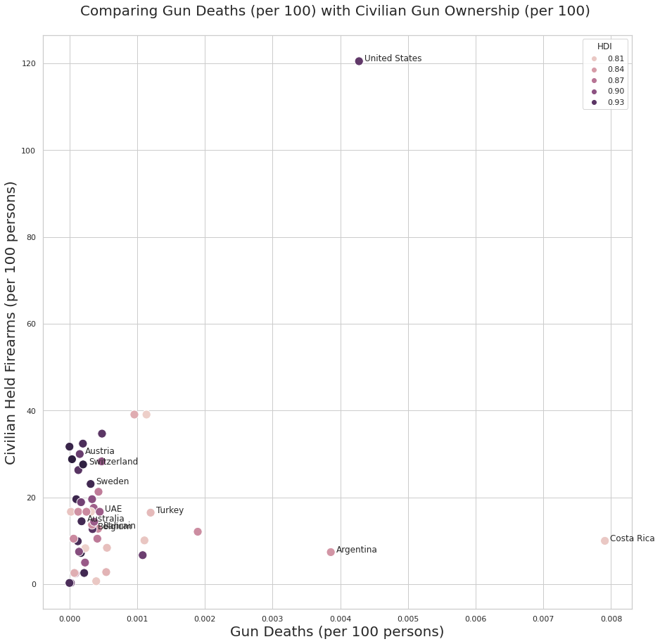

# Comparing civilian gun ownership (per 100) with deaths resulting from interpersonal conflicts

# Data Sources
I've collected and cleaned data, mainly from around 2017, related to gun deaths, firearm ownership, happiness, income, etc. These are all collected from publicly available sources.

[Reddit Post](https://www.reddit.com/r/Infographics/comments/vunkv3/gun_deaths_per_5m_people_compared_to_ownership/)

[Death Data](https://vizhub.healthdata.org/gbd-results/#state=eyJpZCI6IjZiMWE0YzBjLTM0NDYtNDk0Ny1hNjcyLTg4YjM4OGUwZjg3NiIsIm1ldGEiOnsiaW50ZXJhY3Rpb25UeXBlIjoicmVkaXJlY3QifX0%3d&client_info=eyJ1aWQiOiJiYTRjMWQ4Mi0zMGE1LTQxNzItOTM3ZC0xYjI3NDYzODdhOWMtYjJjXzFhX3NpZ251cF9zaWduaW4iLCJ1dGlkIjoiYTA3NjU1ZjYtZTQ4Mi00MmYzLThiMzAtNmI3ZDAwOWY4MTNkIn0&code=eyJraWQiOiJiS2szUnJCSkxKczBiT2VoeTdHT1VZaGlBYWhVMHlXb01pNU1aUkRmLUU4IiwidmVyIjoiMS4wIiwiemlwIjoiRGVmbGF0ZSIsInNlciI6IjEuMCJ9.FipGmT_mq8vKu19kkoCb0FUhV5vXfjfkyhhPkgu9uhP7-5uqhAhGA1hZ5TQ6uex5rg-VMYse_mTqksHijQezZU7YErZIpqMxAESzzj3oM4NQSGra8N_XnsjT5nUCAu35G_RSX9UnJUw-tv6fM-VDkKvJsta6hqIWTNWeLurCiTiz1kntndP3fplJxBWcZN1y3iED6ifEfdvcrUl-Ly4yU5oDFOu5_UJkvwduT_h2zIHxTV_cfUj4PSS1PVshhpUilwTT3tMK2JN4-OcpoRvqdyEaFRx1UKW5NfMdES_aHvix1h8pA7ovpLaFj8yhJfoz4fGNHY7CtKUiMEwH7Hy1tQ.fHog58lBU-8B21Vt.Y5pb5G6d0Wc-H7evNL5QN5cJWJ9nmpy37lZfLlVnbiIdjBx7qJ4DW5W1RlbKeoV_NDqHmqqCIDjTXF11P_OO0CJCfaDQ42mWpu5S25R6SVFS3A1z6dh_N5XuELQdPXIKT2CuIcTWjpnyur_wZqvoLga31yfhbuuTBXgQvwv8sYJGLfiu5B45HBht1_9VdyUf_-PosrUh4TT7jYmSqPirf7YoPSqsuzj3PtbvNX3iirSeU--GoSqicpvwHUvIDhTyu3kuza5eEkkPg58H8Ujz4rmR5aOafrFrrbnU23y-tPeb13Zd4l_anSzbmvso2llg5OzIFWfSoVjw5CTHEV2zNCDD4nYAT6VSV5mVuWbK8XhieEHRTESsNcviwuTdQC4Ww5TKR3R7mcEN8SQCnoSAfdgDjGR4BZrziDZUGy4bjIvjwRyI-Lm_yG6yXiJw2KWeXFpjebnVwZ1zJJ2EE1348xJCf3Z5iLEYaqI8RNWhA92gR2rlku1an7DtB6FeTy7ZpovCMVaLPlsB4Gws4IOA9apRfgU576SizXRhwkkG1RxdfvkQalVtW9KoH9YFx7C3U3BD6gGQVIXAm5F7xXZJD9USu6wsan1orfl6zf_lwraNHKWLnSa7-1yDzY4qgQJENezmWBpg2OewpYEu4_PrCbJj36ZcSzUsQi7XfRZL2h5PrhwTVZl5yrWp28hncshIBS7w0yjbwyOuMizEWZ4MS2R7PKd6hBCuCeVghc8rjIsydsji44baFwbO3-5HgMZjInzbE1G3wFQieor3SKY576p8d9mDai843mGdp4x2JoJVCwQO2XXwcpm1yPxabYYR8-ksL3dz0doAX52JTuBnaRLyivUaZyAGwyRJboo4k3__puixicEOL0Ffnsxggq8gyyapjDI-YF5O6pYO8TncahLQuJlxoHIWB5Wgh75O9phE9G2dr1It4DUHtpHND0a_Xv054noH5O8ItHv0Jj420vv-8FQo2E1-UvaaRmFdb8KJcgRAQiJ6w-Xu0LF8mQ.c5pBWJChG5fg3S-zfIrxlQ)

Some critics said that this lumped in suicides and accidentals. This dataset, although I still need to double check, looks at interpersonal conflicts that resulted in a death by firearm. See the linke above for more information. 

[Small Arms Survey](https://www.smallarmssurvey.org/sites/default/files/resources/SAS-BP-Civilian-Firearms-Numbers.pdf)

Small regularly conducted survey of gunownership around the world.

[IQ and Income](https://www.worlddata.info/iq-by-country.php)

[Human Development Index](https://worldpopulationreview.com/country-rankings/developed-countries)

For IQ, incomen and develop, selected variables were recorded on or near 2017 for accurate comparison.

## Goals for data

I'm interested in exploring possible relationships between gundeaths and other country-level variables (e.g., happiness, income, education, etc.). But I'm posting this publically for whatever purpose. 

